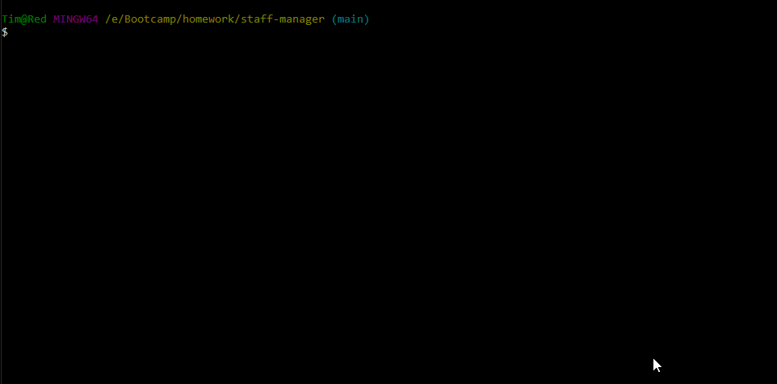
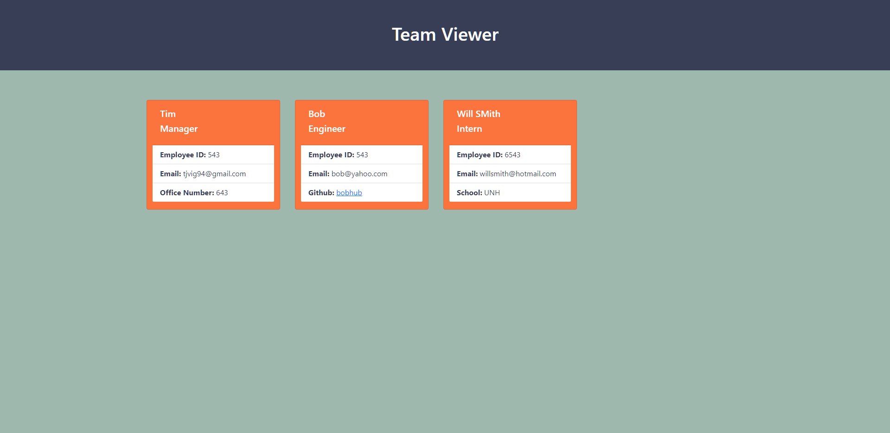

# Staff Manager [](https://opensource.org/licenses/MIT)

## Table of Contents

 - [Description](#description)
 - [License](#license)
 - [Usage](#usage)
 - [Technology and How It Works](#technology-and-how-it-works)
 - [Questions](#questions)

## Description
This is a CLI that allows you to quickly generate a webpage with an organized overview of the members of your project's team. Employee roles, ID's, email, and other information is displayed.

## Usage
Navigate to the file directory, and run using
```
node index
```




Be sure you are entering accurate information. This application currently has very basic validation. It can check to make sure you have input certain values (for exmaple, if you have input the "@" in the email address prompt, or if a value entered should be a number) and will ensure you do not leave anything blank. However, it currently cannot check if an email address is TRULY a valid email or not - only that you have entered a valid email address format. The same goes for github usernames.

## Technology and How It Works
This javascript application uses node.js and inquirer.

## License

Copyright 2021, Tim Vigneau 

[](https://opensource.org/licenses/MIT)

Permission is hereby granted, free of charge, to any person obtaining a copy of this software and associated documentation files (the "Software"), to deal in the Software without restriction, including without limitation the rights to use, copy, modify, merge, publish, distribute, sublicense, and/or sell copies of the Software, and to permit persons to whom the Software is furnished to do so, subject to the following conditions:
        
The above copyright notice and this permission notice shall be included in all copies or substantial portions of the Software.
        
THE SOFTWARE IS PROVIDED "AS IS", WITHOUT WARRANTY OF ANY KIND, EXPRESS OR IMPLIED, INCLUDING BUT NOT LIMITED TO THE WARRANTIES OF MERCHANTABILITY, FITNESS FOR A PARTICULAR PURPOSE AND NONINFRINGEMENT. IN NO EVENT SHALL THE AUTHORS OR COPYRIGHT HOLDERS BE LIABLE FOR ANY CLAIM, DAMAGES OR OTHER LIABILITY, WHETHER IN AN ACTION OF CONTRACT, TORT OR OTHERWISE, ARISING FROM, OUT OF OR IN CONNECTION WITH THE SOFTWARE OR THE USE OR OTHER DEALINGS IN THE SOFTWARE.

## Questions
Email: tjvig94@gmail.com

Github: [tjvig94](https://github.com/tjvig94)

